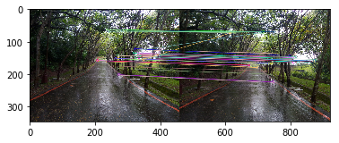
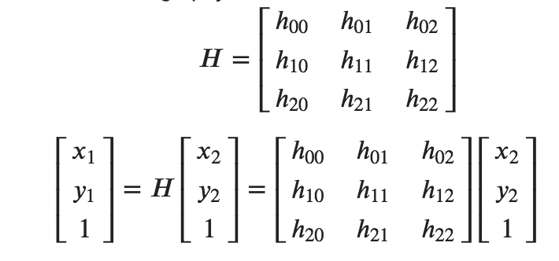
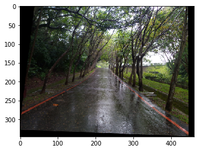
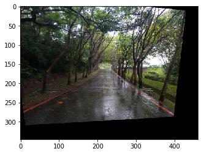
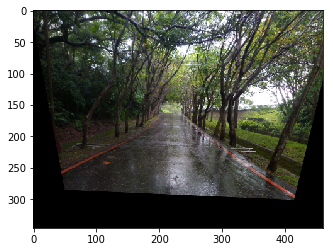

# CVFX-homework-4
Homework 4 for CVFX, team 7.

## 前言

本次作業需要我們在校園中拍一些照片，並利用feature extraction技術（例如orb、SIFT、SURF）對這些照片做matching， 用這些matching對照片做alignment，以製造出zoom in的效果。同時也要比較不同feature extration做出來的結果。

在這些照片中，因為我們的色調還滿一致的，所以問題比較少；主要是在align的時候，因為樹與路的邊會變形，導致出來的結果會不一致、不自然，所以我們先用edge enhence增加邊的辨識度，再用blur來稍微消除這些痕跡。

最後，除了使用python疊圖，我們也有嘗試用photoshop做，就可以對每一張照片手動調整光線色調，圖與圖的縫隙就會比較少。

## Taking a Sequence of Moving-forward Photo in NTHU campus

我們照的照片是楓林小徑，要走上人社院的坡。

照片在這： https://drive.google.com/drive/u/0/folders/1cUR4V76VG6DpgVZ-LzEVc3LfOJngAWjO

## Feature Extraction and Matching Results between 2 Images

這兩張圖是用ORB做feature extraction然後matching。這是前15%的結果，大概可以中間路的盡頭、路邊緣的紅線、盡頭上方的樹看出大致上是正確的。

## Perform image alignment and generate infinite zooming effect 
### Feature Extraction + Image Alignment
Feature extraction的流程如下：
1. 初使化一種feature detector。
2. 用這個detector分別在兩張照片上找key points，detectAndCompute會回傳keypoints跟descriptors作為之後matching使用。
3. BFMatcher是用來計算descriptor距離的，crossCheck設true是為了產生較好的結果。
4. call bf.match()來產生兩張圖之間的matching的距離，並用遞增的方式排列，因為距離越小表示越接近。
5. 之後採用這些matches的中距離最近的前15%，相信這樣足夠正確也足夠多做採樣。
6. 要比較的話，用drawMatches畫出結果。

Image Alignment的流程如下：
1. 找出這15%matches的位置存在np array裡。
2. 求homography。同一平面上、不同視角的兩張圖片之及的關係可以用homography表示，homoprahy是一個3x3的矩陣。  
令 (x1, y1), (x2, y2)分別是第一張與第二張圖對應的點。Homography的公式表示如下：  

3. 有了homography之後，我們使用warpPerspective將遠景img2 match到近景img1上，可以看到這時候的圖會有一些黑色的部分，就是match後轉動視角的結果。

### 將align之後的圖片疊起來
將圖片對齊好之後，我們就要把它們疊在一起使畫面延伸。Match_Merge()是為了讓傳入的兩張圖片正確的疊在一起。其中第一個參數(img1)是原本圖片，第二個參數(changed_img)是經過轉換後與img1對齊的圖片。

步驟:
1. 找出changed_img實際有內容的部分並做成mask。

   a. 將changed_img轉成灰階並用threshold將所有值大於零的像素都變成255(白色)，白色部分大致上都是有內容部分。
   
   b. 為了避免內容部分也有像素值為零的地方，因此接著要用findContours找出邊界，並把邊界內都塗成白色，才確保mask的正確性。
   
   c. 由於現在mask是反的，因此還要做Inverse(使用bitwise_not)。
   
2. 將img1套上mask使它在所有changed_img對應的地方都變成零(黑色)。(使用bitwise_and)  
3. 將img1和changed_img做OR運算，即可正確合併兩張圖。

### 結果與比較
|項目|orb|sift|surf|
|:--:|:--:|:--:|:--:|
|前兩張align結果||||
|觀察|是三者中黑邊最少的，也就是prespective兩張旋轉最少的。|像是以左邊的邊為旋轉軸，向畫面內旋轉。|像是以最上面的邊為旋轉軸，向畫面內旋轉。|
|全部align後疊合||||
|Align過程中有edge enhence & blur||||

### generate infinite zooming effect

#### 使用SURF的結果

<a href="https://youtu.be/DPRwJzxvCIc"> 影片連結 </a>

## Add some image processing to enhance effect

### SURF with edge enhence and blur

<a href="https://youtu.be/aJSYeOXAsHQ"> 影片連結 </a>

### 完全使用Photoshop人工製作

總共使用七張連續的圖片，以對齊馬路上兩條紅線為主要目標，將每張圖都設為前一張長寬的0.7~0.8倍，而除了修改圖片的亮度與對比外，還將圖片間銜接處用羽化處理使接點較不明顯。

<a href="https://youtu.be/VStJBSQnyOA"> 影片連結 </a>

## Conclusion

用疊圖的方式去處理的話，在邊緣自動就會有個延伸的效果，不過相對的延伸也會造成對齊的不準確，像是邊緣的樹有出現無法修補的斷裂，路的中間與樹較高的部分也有出現一些不自然的接縫。會造成這樣的結果有一點是我們選擇的景象較為複雜，樹枝只要位置差一點點整體看起來就會很不自然，選擇較為單一的景象（例如室內建築的牆壁...），應該可以把影響降的較小。還有，可以透過裁切將邊緣一些明顯的失敗部分剪去，可以較為自然。本來多做edge enhence與最後的blur是希望邊緣清楚一點讓key points可以判斷的比較好，但是這個效果在小圖上的改善比較明顯，後來將圖放大之後，就沒有太大的區別。
用photoshop的方式處理的話，因為可以手動調整每一張的亮度色調，所以整體感覺較一致；但是會樹明顯會重複，我們認為是拍照間隔太短的緣故，若走遠一點才拍下一張，應該效果會較好。

## Code implement

實作的所有code在主目錄下的<a href="https://github.com/jessie040718/CVFX-homework-4/blob/master/HW4_team7.ipynb"> HW4_team7.ipynb</a>.

